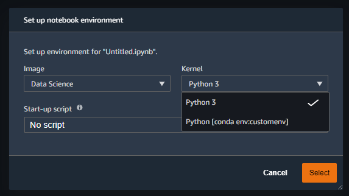

# Custom Conda environments on SageMaker Studio

This repository has steps to create persistent custom conda environments for SageMaker Studio by creating the environment on on EFS.

## Installation steps

1. From SageMaker Studio, open an image terminal of a conda supported first party kernel image (e.g., datascience)
2. Create the custom conda environment as follows:
```
mkdir -p ~/.conda/envs
conda create -p ~/.conda/envs/custom
conda activate custom
conda install scikit-learn numpy ipykernel
```
3. Create a .condarc file on the EFS volume (`~/.condarc`)with the following content:
```
envs_dirs:
  - ~/.conda/envs
```
You can now use `conda activate custom` and `conda deactivate` to use the custom environment from within the `datascience` kernel. 

To use the custom environment in a notebook, open a notebook using the datascience image, and click on the kernel switcher. You will be able to see the custom environment listed under the 'kernel' dropdown as shown in the image below.



*Note:*
- It might take a few minutes for the custom environment to be picked up by the notebook kernel switcher.
- Make sure ipykernel is installed in the custom environment. If not, you will still be able to switch in the image terminal, but the option will not be displayed in the kernel switcher.
- The custom environment should be created in an **image terminal** and not the system terminal. 
- Ensure that you are choosing the right image in the kernel switcher, for example, if conda environment is created in datascience 1p image, the custom kernel will only show under Data Science image. 


### Optional steps
1. Build the docker image and push to ECR. Attach the docker image to the SageMaker Studio Domain. You can use the AWS Console or the command line as described below:

```bash
# build image
REGION=<aws-region>
ACCOUNT_ID=<aws-account-id>

# Build and push the image
IMAGE_NAME=custom-conda-env
aws --region ${REGION} ecr get-login-password | docker login --username AWS --password-stdin ${ACCOUNT_ID}.dkr.ecr.${REGION}.amazonaws.com/smstudio-custom
docker build . -t ${IMAGE_NAME} -t ${ACCOUNT_ID}.dkr.ecr.${REGION}.amazonaws.com/smstudio-custom:${IMAGE_NAME}
docker push ${ACCOUNT_ID}.dkr.ecr.${REGION}.amazonaws.com/smstudio-custom:${IMAGE_NAME}

# Create image through CLI
 aws sagemaker create-image --image-name conda-efs --role-arn <Role> --display-name "Conda with EFS backed env"
 aws sagemaker create-image-version --base-image <image ECR ARN> --image-name conda-efs
 aws sagemaker create-app-image-config --cli-input-json file://app-image-config-input.json
 aws sagemaker update-domain --cli-input-json file://update-domain.json
 ```
You can also use the console instead to [create and attach a custom image](https://docs.aws.amazon.com/sagemaker/latest/dg/studio-byoi-create.html).

2. Create a notebook with the custom EFS backed conda image.

3. For installing packages permanently on EFS, use the image terminal of the custom image. You can install packages like in the example below:

```bash
conda activate custom
conda install seaborn pyarrow
```


